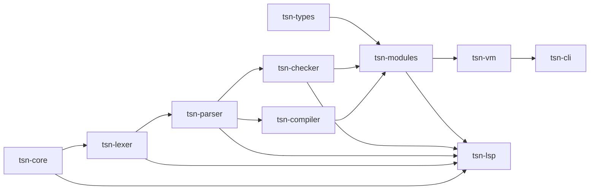
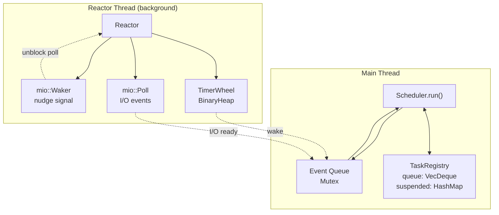
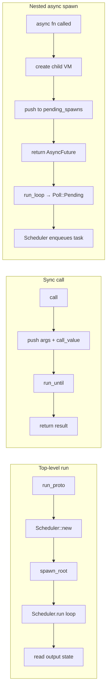

# TSN — TypeScript Native

## Project Overview

TSN is a **statically-typed, compiled language** with TypeScript-inspired syntax that compiles to native bytecode running on a custom stack-based VM. It is written in **Rust** and implements a complete end-to-end compilation pipeline:


### Key Features

- **Rich type system** — generics (multi-phase resolution), union/intersection types, nullable types, `never`/`dynamic`, flow-sensitive type narrowing
- **Object-oriented** — classes, interfaces, abstract classes, single inheritance, extension methods, vtable dispatch
- **Async/await** — cooperative multitasking scheduler with `Future<T>` and async generators
- **Pattern matching** — exhaustive `match` with union/enum coverage checks
- **Standard library** — 16+ modules (`std:fs`, `std:http`, `std:crypto`, `std:json`, etc.)
- **Language Server (LSP)** — hover, go-to-definition, completions, diagnostics, semantic tokens
- **VS Code extension** — full IDE integration

### Current Status

**v0.9 (Pre-release)** — Language semantics stable, compiler + VM stable, type system mostly complete, standard library in progress, JIT experimental.

---

## Project Structure

```
crates/
  tsn-core/       — AST, opcodes, tokens, source model (shared types)
  tsn-lexer/      — Tokenizer (source → token stream)
  tsn-parser/     — Parser (tokens → AST)
  tsn-checker/    — Type system, symbol resolution, binder
    src/types/      — Type struct, Display, stdlib_key, nullable, origin (8 files)
    src/binder/     — mod.rs, result.rs, decls.rs, decl_classes.rs,
                      decl_values/, imports.rs, type_inference.rs, type_resolution/
    src/checker/    — mod.rs, stmts.rs, decls.rs, compat/ (8 files)
    src/checker_expressions/ — members/, infer/, check/ (each modularized)
  tsn-compiler/   — IR generation and bytecode emission
    src/emit/       — mod.rs, scope.rs, smart_pop.rs, context.rs, well_known.rs,
                      decls.rs, patterns.rs,
                      exprs/ (12 files), stmts/ (11 files)
  tsn-types/      — Runtime value types (VM-facing)
    src/value/      — mod.rs, alloc.rs, shape.rs, runtime_obj.rs, class.rs,
                      object.rs, closure.rs, constructors.rs, traits.rs, future.rs
  tsn-op-macros/  — Macro helpers for opcode definitions
  tsn-runtime/    — Runtime support utilities, intrinsic implementations
  tsn-modules/    — Module registry, loader, stdlib/builtin management
  tsn-vm/         — Stack-based bytecode VM + async scheduler + intrinsic bindings
    src/vm/         — mod.rs, frame.rs, generator.rs, math.rs,
                      call/ (7 files), exec/ (11 files), props/ (6 files)
    src/runtime/    — scheduler.rs, reactor.rs, task.rs, heap.rs
    src/intrinsic/  — Native implementations (math, console, fs, http, crypto, etc.)
  tsn-cli/        — CLI binary (`tsn`)
  tsn-lsp/        — Language Server Protocol binary (`tsn-lsp`)

tsn-stdlib/       — Standard library source (TSN + Rust native modules)
  builtins/       — Builtin modules (injected into global scope)
  std/            — Standard library modules (imported via `std:xxx`)

examples/         — 33 example TSN programs (01-arithmetic through 33-async-stress-smoke)
docs/             — Documentation (spec, install, getting started, roadmap, stdlib)
extension/        — VS Code extension
scripts/          — Install scripts (install.ps1, install.sh)
AUDIT.md          — God files audit + modularization plan
```

### Dependency Graph



---

## Building and Running

### Prerequisites

- **Rust 1.75+** and Cargo

### Build

```sh
# Full workspace build
cargo build --release

# Check only (faster)
cargo check --workspace
```

### Install (Recommended)

```sh
# Windows
powershell -ExecutionPolicy Bypass -File .\scripts\install.ps1

# Linux/macOS
chmod +x ./scripts/install.sh
./scripts/install.sh
```

The install script:
1. Builds `tsn` and `tsn-lsp` release binaries
2. Copies them to `~/.tsn/bin/`
3. Copies `tsn-stdlib/` to `~/.tsn/stdlib/`
4. Sets `TSN_HOME`, `TSN_STDLIB`, `TSN_CACHE_DIR` environment variables
5. Adds `~/.tsn/bin/` to PATH

### Run TSN Programs

```sh
tsn file.tsn                    # run a program
tsn examples/main.tsn           # run the full example suite (33 tests)
tsn --debug=lex file.tsn        # print token stream
tsn --debug=parse file.tsn      # print AST
tsn --debug=types file.tsn      # print type info
tsn --debug=disasm file.tsn     # print bytecode
tsn bench file.tsn              # benchmark the pipeline
tsn doctor                      # verify environment setup
```

### LSP Server

```sh
tsn-lsp   # runs as stdio-based language server for IDE integration
```

---

## Development

### Pre-PR Checks (Mandatory)

```sh
cargo fmt --all --check
cargo clippy --workspace --all-targets -- -D warnings
cargo check --workspace
cargo run --release --bin tsn -- ./examples/main.tsn
```

### Cargo Profiles

| Profile    | opt-level | LTO  | codegen-units | panic  |
|------------|-----------|------|---------------|--------|
| `release`  | 3         | true | 1             | abort  |
| `dev`      | 1         | —    | —             | (default) |

### Workspace Crates

The project uses a Cargo workspace with 12 member crates and `resolver = "2"`.

### Codebase Refactoring

All 30 god files (>400 lines) have been modularized into focused submodules. See [AUDIT.md](AUDIT.md) for the full plan.

**Refactored modules** (all compile cleanly, 0 new warnings):

| Crate | Before | After | Files |
|-------|--------|-------|-------|
| `tsn-compiler/emit/exprs` | 1039 lines | 12 submodules | `literals`, `identifiers`, `binary`, `conditional`, `member`, `call`, `compound`, `function`, `match`, `type_assert`, `assign`, `mod.rs` |
| `tsn-compiler/emit/stmts` | 825 lines | 11 submodules | `blocks`, `conditionals`, `loops`, `iterators`, `switch`, `control`, `exceptions`, `sum_types`, `namespaces`, `expr_stmt`, `mod.rs` |
| `tsn-compiler/emit` | 438 lines | +5 files | `scope`, `smart_pop`, `context`, `well_known`, existing `mod.rs`, `decls`, `patterns` |
| `tsn-vm/props` | 659 lines | 6 submodules + pre-existing 9 | `iterator`, `getter_setter`, `property`, `index`, `fixed_field`, `symbol` |
| `tsn-vm/call` | 404 lines | 7 submodules | `closure`, `async_gen`, `method`, `native`, `class`, `rest`, `mod.rs` |
| `tsn-checker/compat` | 638 lines | 8 submodules | `primitives`, `unions`, `functions`, `objects`, `classes`, `named`, `templates`, `mod.rs` |
| `tsn-checker/members` | 594 lines | 6 submodules | `member_lookup`, `member_inheritance`, `member_extension`, `member_union`, `member_alias`, `mod.rs` |
| `tsn-checker/type_resolution` | 1086 lines | 10 submodules | `primitives`, `compound`, `named`, `templates`, `keyof`, `indexed`, `mapped`, `conditional`, `stdlib`, `mod.rs` |
| `tsn-checker/decl_values` | 1057 lines | 5 submodules | `variables`, `types`, `namespaces`, `extensions`, `mod.rs` |
| `tsn-checker/types` | 780 lines | 8 submodules | `type_impl`, `type_display`, `function_type`, `member`, `stdlib_key`, `nullable`, `origin`, `mod.rs` |
| `tsn-checker/infer` | 754 lines | 10 submodules | `literals`, `binary`, `member`, `call`, `function`, `compound`, `unary`, `flow`, `async_members`, `mod.rs` |
| `tsn-checker/binder` | 426 lines | 6 submodules | `mod.rs`, `result`, `decls`, `decl_classes`, `decl_values/`, `imports`, `type_inference`, `type_resolution/` |
| `tsn-types/value` | 847 lines | 10 submodules | `alloc`, `shape`, `runtime_obj`, `class`, `object`, `closure`, `constructors`, `traits`, `future`, `mod.rs` |

**Extension methods fix**: During refactoring, a bug was introduced where extension member lookups used `self.line as u32` (line number) instead of `range.start.offset` (byte offset). The checker records extension mappings by byte offset, so the compiler lookup must match. Fixed in `emit/exprs/member.rs` and `emit/exprs/call.rs`.

---

## Module System Architecture

TSN uses a **unified module registry** (`tsn-modules`) as the single source of truth for module resolution. Key concepts:

- **`ModuleSpec`** — Each module has a single descriptor with checker source (always a `.tsn` file) and runtime source (either TSN or native Rust).
- **`MODULE_REGISTRY`** — Static slice of all registered modules in `tsn-modules/src/registry.rs`.
- **`ModuleLoader`** — Unified loader handling resolution, caching, and lazy loading. The checker and VM both receive it by reference/ARC.
- **Module kinds**:
  - **Builtin** — Injected into global scope of every file (no import needed). Examples: `print`, `assert`, `NaN`.
  - **Stdlib** — Loaded lazily on first `import { X } from "std:foo"`.
- **Contract test** — A test in `tsn-modules/tests/registry_contract.rs` verifies that TSN type declarations match runtime exports, preventing checker/runtime divergence.

---

## Language Syntax Highlights

```tsn
// Variables
const name: str = "Alice"    // immutable
let count: int = 0           // mutable

// Classes + inheritance
class Dog extends Animal {
    override speak(): str { return this.name + " barks!" }
}

// Generics
class Box<T> { value: T; constructor(v: T) { this.value = v } }

// Async/await
async function fetchData(id: int): str {
    await sleep(100)
    return "data:" + id
}

// Pattern matching (exhaustive)
const label = match status {
    200 => "OK",
    404 => "Not Found",
    _   => "Unknown"
}

// Extension methods
extension StringUtils on str {
    shout(): str { return this + "!!!" }
}

// Resource management
using conn = new Connection()  // auto-dispose on scope exit
```

---

## Standard Library Modules

| Module | Purpose |
|--------|---------|
| `std:async` | spawn, sleep, async utilities |
| `std:collections` | Range, collection utilities |
| `std:console` | log, warn, error, info |
| `std:crypto` | sha256, sha512, hmac, uuid, base64, randomBytes |
| `std:dispose` | Disposable, AsyncDisposable interfaces |
| `std:fs` | readFile, writeFile, exists, mkdir, readDir, remove, copy, rename |
| `std:http` | get, post, HTTP server |
| `std:io` | readLine, readAll, write, flush |
| `std:json` | JSON.parse, JSON.stringify |
| `std:math` | Math.* constants and functions |
| `std:path` | Path.* utilities |
| `std:reflect` | Metadata/reflection API |
| `std:result` | Result<T, E>, ok, err |
| `std:sys` | Sys.platform, args, env, exit |
| `std:test` | assert, assertEqual, fail |
| `std:time` | Time.now, millis, toISOString |

---

## Documentation

| Document | Location |
|----------|----------|
| Getting Started | `docs/GETTING_STARTED.md` |
| Installation | `docs/INSTALL.md` |
| Language Specification | `docs/TSN-SPEC.md` |
| Standard Library Reference | `docs/STDLIB.md` |
| Roadmap | `docs/ROADMAP.md` |
| Contributing | `CONTRIBUTING.md` |
| Security Policy | `SECURITY.md` |
| God Files Audit | `AUDIT.md` |

---

## Deep Technical Reference

### 1. Virtual Machine Architecture

The TSN VM (`tsn-vm`) is a **stack-based bytecode interpreter** with inline caching, vtable dispatch, and a cooperative async scheduler. It is structured around these core components:

#### 1.1 Core Data Structures

**Stack Machine**: The VM operates on a single value stack (`Vec<Value>`) managed by **call frames**. Each frame tracks:

```rust
struct CallFrame {
    closure: Arc<Closure>,   // Function proto + upvalues
    ip: usize,               // Instruction pointer (index into chunk.code)
    base: usize,             // Stack base index for this frame's locals
    current_class: Option<Arc<ClassObj>>,  // For `this` and super resolution
    ic_slots: Vec<CacheEntry>,             // Inline cache for property/method access
}
```

**Execution loop** (`Vm::run_until`): A single `while` loop that:
1. Fetches the next opcode byte from the current frame's bytecode
2. Dispatches via a `match` on the `OpCode` enum (95+ opcodes)
3. Each opcode handler reads operands via `read_u16()` (advances `ip`) and manipulates the stack
4. Loop terminates when `frames.len() <= stop_at` (call depth boundary)

**Value representation** (`tsn-types::Value`): A 24-byte enum with reference-counted heap objects:

```
Value (24 bytes = discriminant + payload):
  Immediate:  Null, Bool, Int(i64), Float(f64), Char
  Boxed:      BigInt(Box<i128>), Decimal(Box<Decimal>)
  Ref-cnt:    Array(ArrayRef), Object(ObjRef), Map(MapRef), Set(SetRef)
  Callable:   Closure(Arc<Closure>), Class(Arc<ClassObj>), BoundMethod, NativeFn, NativeBoundMethod
  Async:      Future(AsyncFuture), Generator, AsyncQueue
  Other:      Spread, Range, Symbol
```

Reference types are raw pointers (`*mut ObjData`, `*mut Vec<Value>`, etc.) allocated via a **thread-local heap allocator vtable**. The `Heap` struct (`runtime/heap.rs`) tracks all allocations in `Vec<ObjRef>` / `Vec<ArrayRef>` / `Vec<MapRef>` / `Vec<SetRef>` and frees them in reverse order on drop.

#### 1.2 Inline Caching (IC)

Each `CallFrame` has an `ic_slots: Vec<CacheEntry>` array for **monomorphic inline caching** of property and method access:

```rust
struct CacheEntry {
    id: u32,        // Shape ID — invalidated when object shape changes
    slot: u16,      // Direct index into object's values array
    is_class: bool, // Whether this is a class instance (for method dispatch)
}
```

When `OpGetProperty` executes on an object:
1. Checks if the object's shape ID matches the cached `entry.id`
2. **Hit**: reads `values[entry.slot]` directly — O(1), no hash lookup
3. **Miss**: performs hash lookup on `RuntimeObject.fields`, updates cache entry

This is the same technique used by V8 and JavaScriptCore for efficient dynamic property access.

#### 1.3 Exception Handling

Exception handling uses a **`try_handlers` stack** of `TryEntry` records:

```rust
struct TryEntry {
    catch_ip: usize,      // IP to jump to when exception is caught
    frame_depth: usize,   // Call frame depth when try was entered
    stack_depth: usize,   // Stack depth when try was entered
}
```

When `OpTry` executes, it pushes a `TryEntry` onto `try_handlers`. When `OpThrow` raises an exception:
1. Pops handlers until one with `frame_depth <= current frames.len()` is found
2. Unwinds all frames above that depth (truncating stack to each frame's `base`)
3. Restores stack to `stack_depth`, pushes the exception value
4. Sets `ip = catch_ip` to resume execution in the catch block
5. If no handler found, returns error with captured stack trace

**Finally inlining**: The compiler emits pending finally blocks inline before `OpReturn` — each active try handler gets a `PopTry` then the finally bytecode is duplicated at each early-exit point.

#### 1.4 Upvalues and Closures

Closures capture outer-scope variables via **upvalues** — reference-counted shared cells:

```rust
struct Upvalue {
    inner: Arc<Mutex<UpvalueInner>>,
}
struct UpvalueInner {
    value: Value,          // Cached value (after closure exit)
    location: Option<usize>, // Some(stack_index) if still on stack, None if closed
}
```

When `OpClosure` executes:
1. For each upvalue: reads `is_local` flag and `index` from bytecode
2. **Local upvalue**: searches `open_upvalues` for an existing upvalue at that stack slot (reuse). If none found, creates new `Upvalue` with `location = Some(base + index)`
3. **Non-local upvalue**: clones from parent closure's upvalue array

When a function returns, `close_upvalues_on_stack(frame.base)` iterates `open_upvalues` and copies any value still at a stack location `>= base` into the upvalue's `value` field, then sets `location = None`. This migrates captured variables from the stack to heap storage.

---

### 2. VTable Dispatch for Virtual Methods

TSN implements **class-based vtable dispatch** for virtual method calls, enabling O(1) method lookup instead of O(n) hash-based dispatch.

#### 2.1 Class Object Structure

```rust
struct ClassObj {
    id: u32,
    name: String,
    superclass: Option<Arc<ClassObj>>,
    vtable: Vec<Value>,                    // Ordered method pointers
    method_map: HashMap<RuntimeString, usize>,  // name -> vtable index
    field_map: HashMap<RuntimeString, usize>,   // name -> slot index
    field_count: usize,
    getter_map: HashMap<RuntimeString, Arc<Closure>>,
    setter_map: HashMap<RuntimeString, Arc<Closure>>,
    statics: RuntimeObject,
}
```

#### 2.2 VTable Construction (Compile Time)

During class compilation (`tsn-compiler`):
1. `OpClass` — creates a new `ClassObj`, pushes it on the stack
2. `OpInherit` — **copies** parent's entire vtable and method_map into the subclass:
   ```rust
   c_write.vtable = s.vtable.clone();
   c_write.method_map = s.method_map.clone();
   c_write.field_map = s.field_map.clone();
   c_write.field_count = s.field_count;
   ```
3. `OpMethod` — for each method:
   - If name already exists in `method_map` (override): **replaces** `vtable[idx]` in place
   - If new name: **appends** to vtable, records new index in `method_map`

This ensures that every class in a hierarchy shares the **same vtable index** for inherited methods. An overridden method at index 5 in the parent stays at index 5 in the child.

#### 2.3 VTable Lookup (Runtime)

`OpInvokeVirtual vtable_idx, arg_count` executes:
1. Gets the receiver object from stack position `len - 1 - arg_count`
2. Reads the receiver's `ClassObj` (error if plain object)
3. Reads `class.vtable[vtable_idx]` — the method closure — in O(1)
4. Inserts the method into the stack just before the receiver: `stack.insert(this_idx, method)`
5. Calls via `call_value` with `arg_count + 1` (including implicit `this`)

The compiler emits `OpInvokeVirtual` instead of `OpGetProperty + OpCall` when:
- It recognizes a method call on a known class type
- The type annotations confirm the member is a method
- The vtable index is known at compile time

This is identical to C++/Java virtual dispatch — the call site bakes in the vtable offset, and inheritance preserves those offsets.

#### 2.4 Instance Field Layout

Classes also use a **fixed-slot field layout** for instance fields:
- `field_map` maps field names to slot indices
- `OpDeclareField` registers a field name and assigns the next available slot
- Instances allocate `Vec<Value>` with `field_count` null slots (`ObjData::new_instance`)
- `OpGetFixedField slot` and `OpSetFixedField slot` access slots directly — no hash lookup
- Subclass fields extend the parent's layout (inherited `field_map` + new entries)

---

### 3. Asynchronous Execution Engine

TSN's async model is a **cooperative multitasking scheduler** with a dedicated I/O reactor thread — conceptually similar to Tokio's single-threaded runtime but custom-built for the TSN VM.

#### 3.1 Architecture Overview



#### 3.2 Task Lifecycle

**Task creation**: When an `async fn` is called at the top level (or via `spawn`):
1. VM detects `Closure.proto.is_async == true`
2. Creates a **child VM** (`Box<Vm>`) with shared globals, type registry, and modules
3. Pushes the child VM + an `AsyncFuture` output handle into `pending_spawns`
4. Returns the `AsyncFuture` to the caller immediately
5. `enqueue_spawns()` drains `pending_spawns` and registers each as a `ReadyTask` in the scheduler's queue

**Task execution** (`run_task`):
1. If resuming from a suspend: pushes the resume value (or dispatches exception)
2. `poll_vm()` runs the VM's bytecode loop until:
   - **`Poll::Ready(result)`**: Task completed. Resolves/rejects the output future.
   - **`Poll::Pending`** with `VmSuspend`: Task suspended (see below)
3. `enqueue_spawns()` collects any new async tasks spawned during execution

**Task suspension** — three reasons a VM suspends:

| Suspend Type | Cause | Scheduler Action |
|---|---|---|
| `VmSuspend::Future(fut)` | `await` on a pending `Future<T>` | Move task to `suspended`, register `fut.on_settle` callback to re-enqueue |
| `VmSuspend::Timer(dur)` | `await sleep(ms)` | Move to `suspended`, reactor's `TimerWheel` schedules wake after `dur` |
| `VmSuspend::Yield(val)` | `yield` in generator | Move to `suspended`, resolve generator's output with `{value, done: false}` |

**Task wake**: When a future settles or timer expires, the reactor pushes an `ExternalEvent` onto the event queue. The scheduler drains it and calls `registry.wake(id, result)` which moves the `SuspendedTask` back into the ready queue with the resume value pushed on its VM's stack.

#### 3.3 The Reactor Thread

`Reactor::spawn()` creates a **dedicated background thread** running `reactor_loop()`:

**Timer management** — `TimerWheel`:
- A min-heap (`BinaryHeap<Reverse<TimerEntry>>`) ordered by `deadline: Instant`
- `sleep(duration)` pushes a new entry and nudges the reactor via `mio::Waker`
- `reactor_loop` computes `time_to_next()` for poll timeout, drains expired entries, pushes `WakeTask` events

**I/O event handling** — `mio::Poll`:
- Native async operations (HTTP, file I/O) register `mio::Evented` sources with a `Token`
- When I/O is ready, `mio::poll` returns events, the reactor maps `Token` → `IoEntry` → `WakeTask`
- Provides the bridge between OS-level async I/O and TSN's cooperative scheduler

**Nudge mechanism** — `mio::Waker`:
- Writing to the waker unblocks `mio::poll` immediately
- Ensures the reactor loop responds to timer additions and I/O registrations without waiting for the full poll timeout

#### 3.4 Future<T> Implementation

`AsyncFuture` is an **Arc-shared, mutex-protected promise/future pair**:

```rust
struct Inner {
    state: FutureState,          // Pending, Resolved(Value), Rejected(Value)
    on_settle: Vec<SettleCallback>,  // Chained callbacks (then/catch/finally)
}
```

- **Thread-safe**: `Send + Sync`, callbacks are `Box<dyn FnOnce(...) + Send>`
- **Non-blocking**: `peek_state()` checks without blocking; `on_settle()` either registers callback or invokes immediately if already settled
- **Callback chaining**: `.then()`, `.catch()`, `.finally()` all register via `on_settle`. The scheduler handles these as `CallbackTask` with `CallbackKind` semantics

#### 3.5 Async Generators (`async function*`)

Async generators use a **channel-based architecture**:

```rust
struct GenChannel {
    pub started: AtomicBool,
    pub done: AtomicBool,
    pub output: RefCell<Option<AsyncFuture>>,
}
```

1. Caller creates `GenChannel`, spawns the generator VM as a task
2. Generator VM runs normally until `OpYield` — suspends with `VmSuspend::Yield(val)`
3. Scheduler resolves the channel's current output future with `{value, done: false}`
4. Caller calls `.next()` on the async generator → gets a new `Future<{value, done}>`
5. When generator function returns (not yields), sets `done = true` and resolves final result

The `AsyncGenDriver` implements the `GeneratorDriver` trait, translating `.next()` calls into `schedule_wake_sync()` calls with resume values.

#### 3.6 Execution Entry Points



---

### 4. Compilation Pipeline

#### 4.1 Lexer (`tsn-lexer`)

**Architecture**: Hand-written, single-pass byte scanner operating on raw `&[u8]`. Produces two parallel outputs:
- `Vec<TokenRecord>` — packed 9-u32-per-token struct-of-arrays (kind, start/end line/col/offset, lexeme offset/len)
- `Vec<u8>` lexeme pool — all lexeme bytes concatenated

**Tokenization algorithm**:
1. Whitespace skip (space, tab, CR, LF)
2. Character dispatch: digit → `scan_number`, quote → `scan_string`, backtick → `scan_template_literal`, ident start → `scan_identifier`
3. **Regex disambiguation**: Tracks `last_kind` to determine if `/` starts a division operator or a regex literal (regex allowed after `)`, `]`, `}`, identifiers, literals, `++`, `--`, booleans, null, this, super)
4. **Template literal tracking**: Manages `template_depth` and `brace_depth` stacks for nested `${...}` interpolations
5. **Maximal munch** for operators: Greedily matches 2- and 3-character sequences (`===`, `>>>=`, `**=`)

**FFI layer**: `tsn_scan` exposes a C ABI function that packs tokens + lexemes into a single heap-allocated buffer for cross-language consumption.

#### 4.2 Parser (`tsn-parser`)

**Architecture**: Recursive descent with **Pratt parsing** for expression precedence.

**Pratt parser precedence** (low to high):
```
None < NullCoalesce < LogicalOr < LogicalAnd < BitwiseOr < BitwiseXor
< BitwiseAnd < Equality < Relational < Pipe < Range < Shift
< Additive < Multiplicative < Exponent
```

`parse_binary_expr(min_prec)`: Reads a unary expression, then loops — if current operator's precedence >= `min_prec`, recurses with higher `min_prec` (right-precedence trick). Right-associative ops (exponent `**`) use `Prec::Multiplicative` as next level.

**Key parsing features**:
- **Speculative arrow parsing**: `could_be_arrow` peeks ahead, `try_parse_arrow` saves position and attempts full arrow parse with restore on failure
- **Generic call disambiguation**: Peeks up to 32 tokens tracking `<`/`>` nesting to distinguish type args `f<T>(...)` from comparison `f < T > (...)`
- **OR-pattern expansion**: `P1 | P2 | P3` in match expands into multiple `MatchCase` entries sharing the same guard and body
- **Constructor property promotion**: `constructor(public name: str)` generates field declaration + param in one parse

#### 4.3 Type Checker (`tsn-checker`)

**Multi-phase architecture**:

**Phase 0 — Type representation**: `Type` wraps `TypeKind<B, S, V, F, M, ()>` from `tsn_core`. The checker provides concrete `FunctionType` and `ObjectTypeMember` constructors. `Symbol` stores kind, name, type, range, async/generator flags. `Scope` stores bindings with parent-chain resolution.

**Phase 1 — Binding** (`Binder`):
- Single AST pass building scope tree + symbol arena
- Collects member maps for classes, interfaces, objects, enums, namespaces
- First-pass type inference for declarations (literals → primitive types, arrays → element type widened)
- Builds extension method/getter/setter registries (mangled name → symbol)
- Resolves type annotations including generics, `keyof`, indexed access, mapped types, conditional types

**Phase 2 — Enrichment**:
- Propagates call return types into untyped variable declarations
- Walks all statements; for variables without explicit types but with call initializers, infers from the call result
- Handles chained call type propagation

**Phase 3 — Full checking**:
- Per-expression type inference with extensive caching: `(expr_ptr, scope_id, infer_env_rev)` as cache key
- **Type compatibility**: Structural subtyping with nominal fallback. Handles literal→primitive subtyping, union membership, intersection requirements, function subtyping (contravariant params, covariant return), object structural subtyping
- **Generic resolution**: Infers type arguments from actual call arguments. Matches parameter types against argument types to collect Named type variable bindings
- **Flow analysis / Type narrowing**: `narrowed_types: HashMap<SymbolId, Vec<Type>>` as a stack per symbol. Type guards push narrowed types; popped at control flow merge points. Memoized by `(scope_id, is_positive, scope_depth)`

#### 4.4 Compiler (`tsn-compiler`)

**Entry**: `compile(program)` or `compile_with_check_result(program, annotations, ...)` → `FunctionProto` containing `Chunk`.

**Chunk format**:
```rust
struct Chunk {
    code: Vec<u16>,          // Bytecode instructions (opcode + operands as u16)
    lines: Vec<u32>,         // Source line number per instruction (for stack traces)
    constants: Vec<PoolEntry>, // Literal values and nested function protos
    source_file: String,
}
```

**Variable resolution** (3-tier):
1. **Local**: Reverse search of scope's locals → slot index → `OpGetLocal n` / `OpSetLocal n`
2. **Upvalue**: Recursively searches parent compiler's locals and upvalues, marks locals as `is_captured` → `OpGetUpvalue n` / `OpSetUpvalue n`
3. **Global**: String-keyed → `OpGetGlobal` / `OpSetGlobal`

**Smart pop optimization** (`emit_smart_pop`): Eliminates unnecessary `OpPop` by transforming the preceding instruction:
- `SET_GLOBAL` → `DEFINE_GLOBAL` (define in place of set+pop)
- `SET_LOCAL` → `SET_LOCAL_DROP`
- `PUSH_CONST`, `GET_LOCAL`, `DUP` etc. → truncates the last instruction entirely

**Control flow compilation**:
- **If/else**: `JUMP_IF_FALSE` + pop + consequent + `JUMP` + patch + alternate
- **While/for**: Record loop start, `JUMP_IF_FALSE` to exit, body, `LOOP` back to start, patch exit
- **For-of**: Calls `iterable[Symbol.iterator]()`, loops calling `.next()`, checks `.done`, extracts `.value`
- **Return**: Compiles argument, **inlines pending finally blocks** in reverse order, emits `PopTry` for each active handler, then `OpReturn`
- **Break/Continue**: Pops locals to boundary, emits forward jump to patch list

**IR representation**: Bytecode is lowered to `BytecodeIrModule` — a control flow graph of `IrBlock` nodes with `IrInstr` lists and `IrTerminator` (Return, Throw, Jump, Branch, Loop, Fallthrough). Optimization passes: remove unreachable blocks (BFS), simplify trivial jumps (chase empty block chains up to 16 hops).

---

### 5. Memory Model

#### 5.1 Thread-Local Heap

All heap allocations use a **thread-local allocator vtable**:

```rust
static VTABLE: AllocVtable = AllocVtable {
    alloc_object: do_alloc_object,
    alloc_array: do_alloc_array,
    alloc_map: do_alloc_map,
    alloc_set: do_alloc_set,
};

thread_local! {
    static HEAP: RefCell<Heap> = RefCell::new(Heap::new());
}
```

`init_heap()` installs the vtable via `install_allocator()`. All `Value::Object`, `Value::Array`, `Value::Map`, `Value::Set` creation goes through `alloc_object()` / `alloc_array()` / `alloc_map()` / `alloc_set()` which delegate to the thread-local vtable. The `Heap` tracks all pointers in typed `Vec`s and frees them in reverse order on `Drop`.

#### 5.2 Shape-Based Object Model

TSN uses **hidden classes (shapes)** for efficient property access:

```rust
struct Shape {
    id: u32,
    property_names: HashMap<RuntimeString, usize>,  // name → slot index
    transitions: Mutex<HashMap<RuntimeString, Arc<Shape>>>,  // name → child shape
}
```

When a property is added to a `RuntimeObject`:
1. Check if current shape has a transition for that property name
2. **Hit**: Transition to child shape (already has the correct slot mapping)
3. **Miss**: Create new shape with new slot index, cache the transition

All objects with the same property addition history share the same shape. This enables inline caching: if two objects have the same shape ID, property `X` is at the same slot index in both.

#### 5.3 Reference Counting

TSN uses **manual reference counting** for heap objects. `Value` holds raw pointers (`ObjRef = *mut ObjData`). When a `Value` is cloned, the pointer